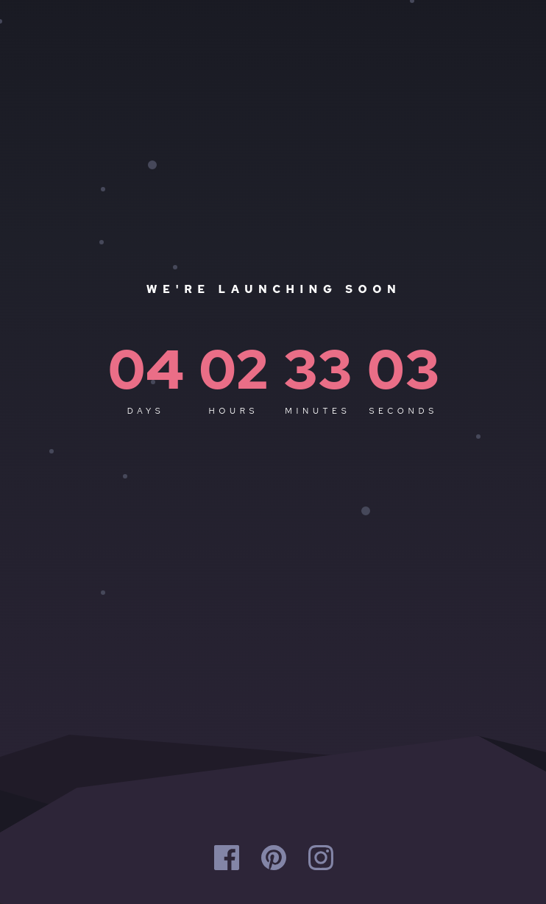

# Frontend Mentor - Launch countdown timer solution

This is a solution to the [Launch countdown timer challenge on Frontend Mentor](https://www.frontendmentor.io/challenges/launch-countdown-timer-N0XkGfyz-).

## Table of Contents

- [Overview](#overview)
  - [The Challenge](#the-challenge)
  - [Screenshots](#screenshots)
  - [Links](#links)
- [My Process](#my-process)
  - [Built With](#built-with)
- [Author](#author)

## Overview

### The Challenge

Users should be able to:

- See hover states for all interactive elements on the page.
- See a live countdown timer that ticks down every second.
- **Next Release Features**: When a number changes, make the card flip from the middle.

### Screenshots

#### Desktop View

#### Mobile View

### Links

- Solution URL: [Frontend Mentor](https://www.frontendmentor.io/solutions/launch-countdown-timer-vjRWWjGV8w)
- Live Site URL: [GitHub Page](https://tarek0m.github.io/launch-countdown-timer/)

## My Process

### Built With

- Semantic HTML5 markup
- CSS custom properties
- Flexbox
- CSS Grid
- Mobile-first workflow

## Author

- Frontend Mentor - [@tarek0m](https://www.frontendmentor.io/profile/tarek0m)
- GitHub - [@tarek0m](https://github.com/tarek0m)
